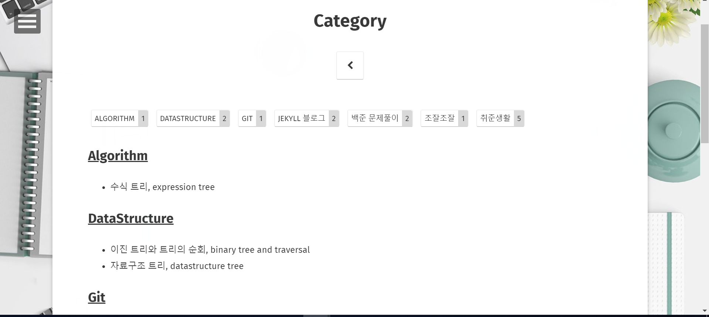

현재 사용중인 지킬 테마를 선택할 때, 태그 기능이 깔끔하게 구현되어 있었기 때문에 "오 이거 카테고리로 이용하면 되겠다!" 라는 생각에 Fork하여 사용하게 되었는데,

아직까진 tag만 사용하다가, 글이 더 많아 지기 전에 카테고리를 만들어 놓는게 좋겠다 싶어서 여기저기 참고하며 만들어 보았다.  

[지킬 공식 페이지의 카테고리 설명](https://jekyllrb-ko.github.io/docs/posts/#%ED%8F%AC%EC%8A%A4%ED%8A%B8%EC%9D%98-%EC%B9%B4%ED%85%8C%EA%B3%A0%EB%A6%AC%EC%99%80-%ED%83%9C%EA%B7%B8-%ED%91%9C%EC%8B%9C%ED%95%98%EA%B8%B0)  
[참고한 블로그](https://devyurim.github.io/development%20environment/github%20blog/2018/08/07/blog-6.html)  
{: .notice}

만들면서 느낀 점은  
코드 부분은 사용하는 지킬 테마에서 뽑아오거나, 간단하게 만들수 있기 때문에  
지킬의 __디렉토리 구조__ 를 이해하는게 가장 중요한 거 같다.

# 카테고리 만든 과정

1. [categories 폴더와 index 페이지 만들기](#categories-폴더에-index-페이지-생성하기)
2. [category 레이아웃 만들기](#category-레이아웃-만들기)  
    2-1. [layout이 category인 마크다운문서 만들기](#layout이-category인-마크다운문서-만들기)

## 미리 요약
1. categories/index.html 만들기
2. \_layouts 폴더에 category.html 만들기
3. categories 폴더에 카테고리 이름과 동일한 이름의 markdown문서 만들기
4. 3번에서 만든 markdown 문서에는  
  `layout: category`  
  `title: "카테고리"`  
   YAML 작성하기

- - -

## categories 폴더에 index 페이지 생성하기

__<hly> categories/index.html 파일을 가장 먼저 만들고 </hly>__  
그리고 보여주고 싶은 내용을 index.html에 작성해준다.  




{{ category | first }},





위 코드는 `tags/index.html`의 코드를 재사용한 `categories/index.html`의 일부 인데, tags 부분을 categories로 바꿔주었다.  

처음엔 이게 당최 무슨 언어인가 했는데, 'Liquid' 라는 언어라고.. 액체 언어... 처음 들었다..ㅎㅎ  

찾아보니 아래의 사이트에 사용법들이 잘 정리되어 있고, 막 엄청 어렵지는 않음  

[Liquid 사이트](http://shopify.github.io/liquid/)  
{: .notice}

아무튼 저 코드는 <hly> site.categories 의 정보를 site_categories 라는 변수에 담고,  
site_categories 에서 카테고리 이름들을 categories_List 라는 변수에 담는 일을 하는구나~</hly> 라고 이해했다.  

그래서 다음 코드를 보면,  
반복문을 이용해서 **<hly>categories_list</hly>** 안의 카테고리들을 꺼내 보여주는 작업을 하고 있다.




<ul class="entry-meta inline-list">
  
    {{ categories_list[item] | strip_newlines }}
  	<li><a href="#{{ this_word }}" class="tag">
    {{ this_word }}
    {{ site.categories[this_word].size }}
    </a></li>
  
</ul>


  {{ categories_list[item] | strip_newlines }}
  <article>
	  <a href="{{site.url}}/categories/{{this_word}}"><h2 id="{{ this_word }}" class="tag-heading">{{ this_word }}</h2></a>
    <ul>
    
      <li class="entry-title"><a href="{{ site.url }}{{ post.url }}" title="{{ post.title }}">{{ post.title }}</a></li>
    
		</ul>
    </article><!-- /.hentry -->





이렇게 categories/index.html 을 만들어 준 후,  
`https://png93.github.io/categories/`에 접속하면 내가 만들어준 카테고리별로 정리된 페이지가 나온다!  

<figure>
    
</figure>

- - -

## category 레이아웃 만들기

다음으로 카테고리별로 포스트 목록을 보여주는 페이지를 만들기 위해서  
Jekyll 테마의 디렉토리 중 __<hly>_layouts 폴더에 category.html을 만들어 준다</hly>__  

(category.html을 만든 후, 다음에 만들 markdown문서의 layout으로 사용 할 예정)  

이번엔 지킬 테마에 있던 `_layouts/post-list.html`을 사용하여 필요한 부분만 수정  




      
       <!-- 카테고리 조건 -->
            <ul>
              <!-- post 제목 나열 -->              
            </ul>
      




 

~~~



~~~
위 코드에서 assign은 현재 페이지의 title을 category라는 변수에 할당하는 일을 한다.  
__따라서 category 레이아웃을 사용하는 page(markdown문서)의 title은 카테고리와 동일하게 설정해야 함__  

~~~



~~~
여기선 위에서 얻어온 category와 동일한 category를 가지는 post 들만 뽑아오게 된다.  

- - -

## layout이 category인 마크다운문서 만들기  

레이아웃을 만들었으니 사용을 해보자!  &#128515;

맨 처음에 만들었던 categories 폴더에  
__카테고리 이름과 동일한 이름의 마크다운문서__ 를 만들어 준다. <hlr>(★x1000)</hlr>

<figure>
    
    <figcaption>categories 디렉토리 모습</figcaption>
</figure>

 

각 파일은 'YAML 머리말' 의 layout과 title만 가지면 끄읕.  
Algorithm.md를 예로 들면 아래와 같이 작성하면 된다.

~~~
---
layout: category  
title: Algorithm
---
~~~

---

여기까지 설정을 끝냈다면, 앞으로 포스트용 markdown문서 작성시 YAML에 category 속성을 추가해 주면 카테고리별로 분류하여 보여줄수 있다.

~~~
---
category: [ 백준 문제풀이 ]
---
~~~

이제 `../categories/(카테고리명)` url에 접근하면 아래처럼 해당 카테고리에 대한 글만 나타내는 페이지가 생성다.&#9996;  

<figure>
    
    <figcaption>"백준 문제풀이" 카테고리 화면.</figcaption>
</figure>

- - -
