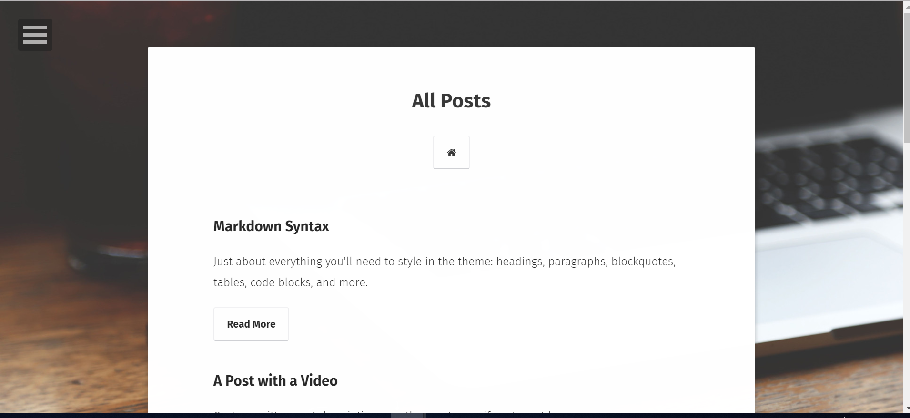
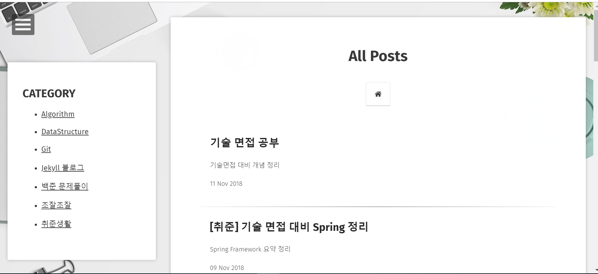
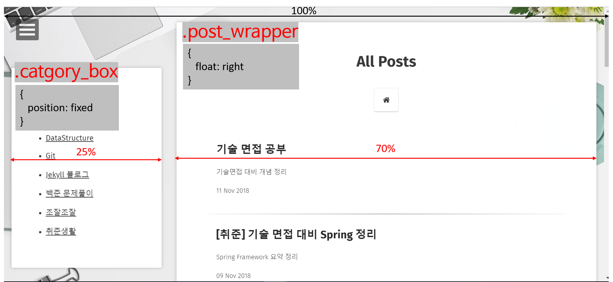

<figure class="half">
  
  
</figure>

첫 번째 사진은 내가 다운받은 테마의 원래 모습이고, 두 번째 사진은 category 메뉴 영역을 추가한 뒤의 모습!  

어떻게 만들었는지 그 과정을 작성해보자. 레고! &#128540;  

## 순서  
1. [위치 및 모양 설정하는 css클래스 만들기](#위치-및-모양-설정하는-css클래스-만들기)
2. [html파일을 css클래스 이용하여 수정하기](#html파일을-css클래스-이용하여-수정하기)

## 위치 및 모양 설정하는 css클래스 만들기

Jekyll 블로그 디렉토리를 보면 css 파일을 모아둔 곳이 있는데,
`_sass/site.scss`에 사이트와 관련된 css가 설정되어 있어서 이곳에서 작업을 진행했다.  

아래와 같은 코드를 추가.
~~~css
.post_wrapper{
  float: right;
  width: 70%;
  margin: 2rem 1rem;
  position: relative;
	background: $white;
	color: $color_tuatara;
	padding: 2em;
	border-radius: 3px;
	box-shadow: 0 0 10px 0 rgba($color_shark,0.3);
	@include transition(.5s);
	@media #{$small} {
		width: 90%;
		padding: 2em 0;
	  box-shadow: none;
	}
}

.category_box {
  position: fixed;
  top: 8rem;
  left: 1rem;
  width: 25%;
	background: $white;
	color: $color_tuatara;
	padding: 2em;
	border-radius: 3px;
	box-shadow: 0 0 10px 0 rgba($color_shark,0.3);

    @media #{$small} {
		visibility: hidden;
	}
}
~~~

요렇게 만들어준 post_wrapper와 category_box css클래스는  
아래와 같은 html구조에서 사용하게 될 예정.  

~~~html
<header>
  

  

  

  

</header>
~~~

<figure>
  
  <figcaption> css로 변경한 주요 부분 </figcaption>
</figure>

## html파일을 css클래스 이용하여 수정하기
다음으로 html 에 css클래스를 추가해주고, 카테고리를 나타내는 html코드도 추가했다.  

[post-list.html]
~~~html
<header class="header" role="banner">
      

          <!-- 생략 (포스트 목록 나타내는 코드) -->
      

      <!-- 카테고리 -->
      
      
      
</header>
~~~

[categorybox.html]
~~~html


    {{ category | first }}
      ,
    



   <h2> CATEGORY </h2>           
   <ul>
      
       {{ categories_list[item] | strip_newlines }}
       <li><a href=" {{site.url}}/categories/{{this_word | strip }} "> {{ this_word }} </a></li> 
    
   </ul>


~~~

post-list.html과 category.html 두 곳에 category 영역을 추가했기 때문에 categorybox.html을 별개로 만들어 include 해주기!  

include 하는 파일들은 \_includes 폴더에 만들어 주면 된다.  

---
