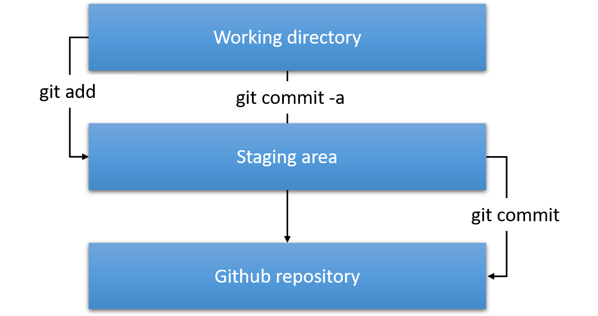
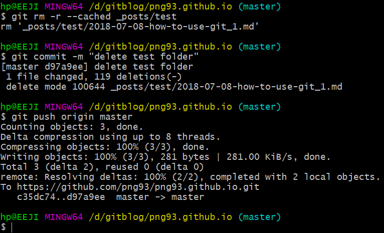

블록체인 프로젝트 또는 개인 프로젝트의 소스코드 공유 및 관리를 위해 git 사용은 필수적입니다. 
그렇기에 현재 내가 많이 쓰고 자주 검색했던 커멘드를 기준으로 작성해 보겠습니다.
글을 쓰면서 머리 속에 다시 한번 정리 되는 효과도 있고, 나만의 자료가 남는다는 장점도 있기에 "꾸준히!!(제발..)" 쓰는 것을 목표로 삼았습니다. &#128588; 
아무튼, 이 글에서는 git 커멘드를 통해 github에 코드를 관리할 때 필요한 아주아주 기초적인 git 사용법을 정리하겠습니다!

---

## contents
1. [초기설정](#초기설정-init-config-clone)
2. [변경사항 반영하기](#git-add)
3. [파일 삭제하기](#삭제-명령어-rm)
4. [branch](#branch)
5. [rebase](#rebase)
6. [기타 명령어](#그-외-명령어)

---

## 초기설정 init config clone

먼저 깃 파일에 올릴 파일로 디렉토리를 이동하고 아래의 커멘트 순서로 입력하시면 됩니다!

<kbd>cd</kbd>  : 디렉토리 변경.

<kbd>git init</kbd>  :  git 저장소 초기화.

<kbd>git config user.name "user name"</kbd>  : 깃 처음 이용하기 전 해당 파일에 대해 작성자가 누구인지 명시합니다.

<kbd>git config user.email "user email"</kbd>  : github에서 사용하는 이메일 계정 입력합니다

<kbd>git clone "Repository 주소"</kbd>  : 원격 저장소를 현재 로컬 디렉토리로 복사합니다.

Repository 주소는 내 저장소 상단 오른쪽에 보면, 'Clone or download'라는 초록색 버튼이 있는데 여기서 복사 해올 수 있습니다.

- - -

## git add

해당 파일을 버전 관리시작하겠다는 의미 입니다. 
즉, add 명령어를 거치지 않은 파일에 대해 변경된 부분은 버전관리 되지 않습니다. 

**▼원격 저장소에 새로운 파일 올리기 ▼**
<figure>
  
</figure>

참고로 git add와 git commit이 명령을 수행하는 단계가 있는데, 아래 그림처럼 동작한다.

{: width="60%" height="60%"}

<kbd>git pull origin master</kbd>  :  원격 저장소의 변경 사항을 가져옴.

나중에 push 하면서 문제가 생길 수도 있기 때문에
파일을 올리기 전에 혹시 있을 변경 사항을 먼저 처리해 주는 게 좋음

<kbd>git add 파일이름</kbd>  :  staging area에 파일 올리기.

( <kbd>git add .</kbd>  : working directory 내의 모든 파일을 staging area에 올리기. )

<kbd>git commit -m "커밋 메세지"</kbd>  : 인라인 메세지를 입력하는 커밋.

( <kbd>git commit</kbd> 명령어도 있는데, 인라인 메세지를 사용하는 게 간편 )

<kbd>git push -u origin master</kbd>  :  원격 저장소에 저장.

---

## 삭제 명령어 rm

삭제는 `$git rm` 명령어를 사용한다.

알아둘 점이 있다면, `$git rm`은 원격 저장소와 로컬의 폴더 또는 파일을 모두 삭제하고,  
`$git rm --cached` 속성을 사용하면 __원격 저장소에서만__ 삭제 된다.

예를 들어 github 저장소에 \_posts/test 라는 폴더를 삭제하려면 다음 명령어들을 입력하면 된다!

<figure>
  
</figure>

파일 삭제는 원격 저장소에서만 삭제 하려면 `$git rm --cached <파일이름>`  
원격 저장소와 로컬 두 곳 모두 삭제하려면  `$git rm <파일이름>`
{: .notice}

---
## branch

쓰는 이유 : 여러 클라이언트의 요구사항이 달라지므로 하나의 파일을 요구사항에 따라 분개하는 경우 사용합니다.

<kbd>git branch exp</kbd> : exp브런치를 만듭니다.

<kbd>git checkout exp</kbd> : exp브런치를 사용합니다.

<kbd>git log —branches —decorate —graph —online</kbd> : 브런치별 commit을 봅니다.

### git 병합
<kbd>git merge exp</kbd> : exp브런치를 master로 병합합니다.
### branch 삭제
<kbd>git branch -d exp</kbd> : exp브런치를 삭제합니다. 

---
## rebase

git log를 통해 commit의 정보를 확인하고 선택적으로 날짜를 임의적으로 바꿉니다.

1. 바꾸고자 하는 commit 날짜의 이전 commit hashID을 기준으로 명령어를 넣습니다. 
<kbd>git rebase -i PrevCommitHashId</kbd>

2. terminal창이 vim창으로 바뀌면 바꾸고자 하는 commit을 pick에서 edit로 바꿉니다.

3. Amend 명령어를 통해 해당 commit의 날짜를 바꿉니다. 
<kbd>git commit --amend --no-edit --date "바꿀날짜 "</kbd>

4. rebase 명령어를 종료합니다. 
<kbd>git rebase --continue</kbd>

5. 새로 만든 커밋을 github으로 push 합니다. 
<kbd>git push --set-upstream origin master</kbd>

---
## 그 외 명령어

<kbd>git remote add origin `https://github.com/png93/png93.github.io` </kbd>  :  github 저장소와 연결하기 (초기설정)  

<kbd>git remote -v</kbd>  : 연결된 원격 저장소 확인  

<kbd>git status</kbd>  :  현재 상태 확인  

